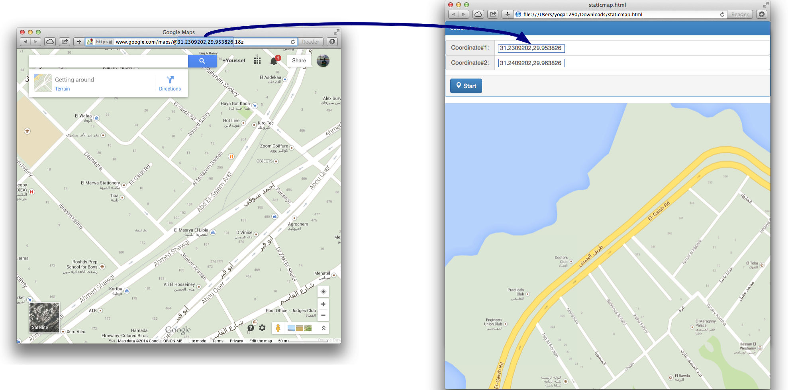

####Draws a map between 2 coordinates w fixed zoom level 18 using the [Google Static Maps API](http://developers.google.com/maps/documentation/staticmaps/)

#Idea:

Briefly speaking, I'm using the Haversine formula to convert the (Latitude,Longitude) coordinates into (X,Y), increase them by a fixed distance; e.g: (X+dX, Y+dY) and then convert them back to the (Latitude,Longitude) to be used in the [Google Static Maps API](http://developers.google.com/maps/documentation/staticmaps/) as new center points

A binary search is used for searching for the corresponding (Latitude,Longitude) values to match a given (X+dX, Y+dY) and Haversine formula as the binary search comparator function

###[Test it ONLINE](http://jsbin.com/xisog/1/watch?output)!

###References:

+ [Google Static Maps API](http://developers.google.com/maps/documentation/staticmaps/)
+ [Haversine formula](http://www.movable-type.co.uk/scripts/latlong.html)